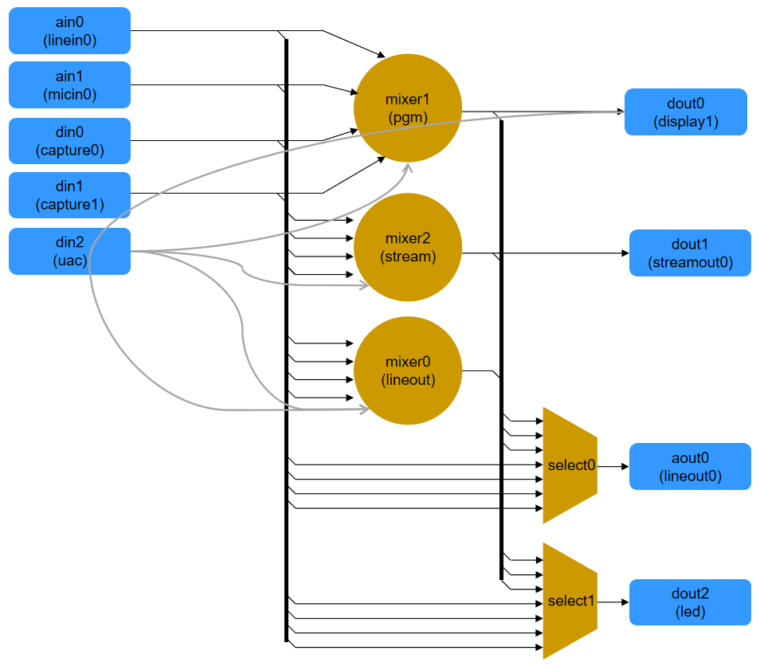

# Audio Engine Controller DBus API


## Table of Contents

[1. DBus Interface](#1-dbus-interface)

[2. Audio Structure ](#2-audio-structure)

[3. Audio Elements](#3-audio-elements)

[4. Access Elements](#4-access-elements)

[4.1 List Elements by Category / Type](#4_1)
	
[4.2 Query Properties](#4_2)

[4.3 Get Variables](#4_3)
	
[4.4 Set Variables](#4_4)

<br>
## 1. DBus Interface

* Destination: 
com.aten.aph.media

* Path: 
/com/aten/aph

* Methods: 
AudioList, AudioQueryCapability, AudioGetVariable, AudioSetVariable

* Signal: 
None

<br>
## 2. Audio Structure 

**There are three main categories of elements: Input, Output and Filter**

The audio structure is built-up by these three main categories. The structure is shown as below:
("inputs" and "outputs" are in  <span style="color:blue">blue</span>, "filters" are in <span style="color:#ff8000">orange</span>.)

 


<br>
## 3. Audio Elements

#### Element Types

| Category | Types |
|-|-|
| Input | ain, din, streamin |
| Output | aout, dout, streamout |
| Filter | mixer, select |

#### Element Get/Set Properties

<br>
## 4. Access Elements

<br>
<a name="4_1"></a>
### 4.1 List Elements by Category / Type 

**Method: AudioList**
List elements of given type.

**Send:**
Input an array of element Type or Categorie strings. 

Ex: Get "input" and "mixer" element lists.

```json
string:
'["input", "ain", "mixer"]'
```

**Return:**

```json
string:
'{
	"input" : ["ain0", "ain1", "din0", "din1", "din2"],
	"ain" : ["ain0", "ain1"],
	"mixer" : ["mixer0", "mixer1"]
	"result" : true
}'
```

| Key Name | Value | Description |
|-|-|-|
| result | Boolean ||
| *type/category* | String Array| Array of element names

<br>
**Method: AudioListIdx**
List elements of given type.

**Send:**
Input an array of element Type or Categorie strings. 

Ex: Get "input", "output" and "filter" element lists.

```json
string:
'["input", "output", "filter"]'
```

**Return:**

```json
string:
'{
	"filter" : {"select0" : 0},
	"input" : {"din0" : 3, "din1" : 4},
	"output" : {"aout0" : 5,"dout0" : 6,"streamout0" : 7},
	"result" : true
}'
```

| Key Name | Value | Description |
|-|-|-|
| result | Boolean ||
| *type/category* | String Array| Dictionary of element names(key) and index(value).


<br>
<a name="4_2"></a>
### 4.2 Query Properties 

**Method: AudioQuery**
Query element name, type, source, sink and effect properties.

**Send:**
Input an array of element names. 

Ex: Get "ain0", "mixer0" and "select0" element properties.
```json
string:
'["ain0", "mixer0", "select0", "effect3"]'
```

**Return:**
```json
string:
'{
	"result" : true,
	"ain0":{
		"name":"ain0",
		"type":"ain",
		"source":["linein0"],
		"sink":["mixer0", "mixer1"],
		"effect_in_cap":[],
		"effect_out_cap":{
			"name" : "effect0",
			"gain": { "unit" : 2, "min" : -1250, "max" : 3750, "step" : 50, "inf": 0}
		}
	},
	"mixer0":{
		"name":"mixer0",
		"type":"mixer",
		"source":["ain0", "ain1"],
		"sink":["aout0"],
		"effect_in":[
			{
				"name" : "effect1",
				"gain": { "unit" : 2, "min" : -8000, "max" : 2000, "step" : 10, "inf": 0 },
				"pan" : { "unit" : 3, "min" : 0, "max" : 10000, "step" : 100, "inf": 0 },
				"switch" : { "unit" : 1},
			},
			{
				"name" : "effect2",
				"gain": { "unit" : 2, "min" : -8000, "max" : 2000, "step" : 10, "inf": 0},
				"pan" : { "unit" : 3, "min" : 0, "max" : 10000, "step" : 100, "inf": 0},
				"switch" : { "unit" : 1},
			}
		],
		"effect_out_cap":{
			"compressor" : { "max" : 2400, "min" : -13500, "step" : 300},
			"delay" : { "inf" : 0, "max" : 14400, "min" : 0, "step" : 1, "unit" : 1},
			"gain" : { "inf" : 1, "max" : 2000, "min" : -8000, "step" : 50, "unit" : 2},
			"index" : 18,
			"name" : "effect01",
			"pan" : { "inf" : 0, "max" : 10000, "min" : -10000, "step" : 100, "unit" : 3},
			"switch" : { "unit" : 1},
			"type" : "effect"
		},
	},
	"select0":{
		"name":"select0",
		"type":"select",
		"source":["ain0", "ain1", "mixer0"],
		"sink":["aout1"],
		"effect_in_cap":[{},{},{}],
		"effect_out_cap":{}
	},

}'
```

| Key Name | Value | Description |
|-|-|-|
| result | Boolean ||
| *element name* | Dictionary | A dictionary contain element properties

**Property Description:**

| <center>Key | Value | Description | 
|-|-|-|
|name		|String		|Name of the element|
|type		|String		|Type of the element|
|source		|String Array	|A array of element name strings, <br>or connector name strings for a input element. |
|sink		|String Array	|A array of element name strings, <br>or connector name strings for a output element.|
|effect_in	|Dict. Array	|A array of input effect capability|
|effect_out|Dict.		|A master output effect capability|
|gain| Dict. |Adjust audio gain. <br>*(Optional, exist if applicable.)*
|pan| Dict. |Adjust stereo left/right balence. <br>*(Optional, exist if applicable.)*
|switch| Dict. |Mute switch. <br>*(Optional, exist if applicable.)*
|delay| Dict. | Adjust latency in millisecond. <br>*(Optional, exist if applicable.)*
|compressor| Dict. | Audio compression. <br>*(Optional, exist if applicable.)*


**Effect Capability Properties:**
Capabilities of each effects are described in dictionary format.

***gain / pan / sw / delay***
```"delay" : { "inf" : 0, "max" : 14400, "min" : 0, "step" : 1, "unit" : 1},```
```"gain" : { "inf" : 1, "max" : 2000, "min" : -8000, "step" : 50, "unit" : 2},```
```"pan" : { "inf" : 0, "max" : 10000, "min" : -10000, "step" : 100, "unit" : 3},```
```"switch" : { "unit" : 1},```

| Key Name | Value | Note | 
|-|-|-|
| unit 	| Int	| Unit of value. <br>1 : absolute value ("1")<br>2 : decibel ("dB")<br> 3 : percentage ("%")	|
| min 	| Int	| Minimum value, percentage point.<br>ex. 1520 means 15.20dB / 15.20%|
| max 	| Int	| Maximum value, percentage point.	|
| step 	| Int	| Value resolution, percentage point. 	|
| inf 	| Int	| Infinity on minimum |

***compressor***
```"compressor" : { "max" : 2400, "min" : -13500, "step" : 300},```

| Key Name | Value | Note | 
|-|-|-|
| min 	| Int	| Minimum value, percentage point (dB).<br>ex. 1520 means 15.20dB |
| max 	| Int	| Maximum value, percentage point (dB).	|
| step 	| Int	| Value resolution, percentage point (dB). 	|

<br>
<a name="4_3"></a>
### 4.3 Get Variables 

**Method: AudioGet**
Get element variables of certain elements.

**Send:**
Input an array of element names. 

Ex: Get "ain0", "mixer0", "mixer1" and "select0" element variables.
```json
string:
'["ain0", "mixer0", "select0", "effect3"]'
```


**Return:**

```json
string:
'{
	"result" : true,
	"ain0":{
		"effect_in":[],
		"effect_out":{"gain":0}
	},
	"mixer0":{
		"effect_in":[
				{"gain":0, "pan":5000, "switch":1},
				{"gain":0, "pan":5000, "switch":1}
			]
		"effect_out":{
			"pan" : 0,
			"gain" : -4000, 
			"switch" : 1,
			"compressor" : {"enable" : 0, "input_threshold" : 0, "output_max" : 0 },
			"delay" : 0,
		}
	},
	"select0":{
		"select": 0,
		"select_idx":21
		"effect_in":[{}, {}, {}],
		"effect_out":{}
	}
}'
```


**Element Values:**

| <center>Key | Value | Description | 
|-|-|-|
|effect_in		|Dict. Array	|A array of input effect dictionaries|
|effect_out	|Dict.		|A master output effect dictionary|
|select		|Int			|Index of selected source|
|gain| Int | Audio gain. *(Optional, exist if applicable.)*<br>The value is read/write as percentage point.<br>Range: minimum to maximum.
|pan| Int | Left/right balence. *(Optional, exist if applicable.)*<br> The value is read/write as percentage point.<br>Range: usually "-10000" to "10000". 
|switch| Int | Mute switch. *(Optional, exist if applicable.)*<br>Off: "0"<br>On: "1". 
|delay | Int | Additional audio latency in millisecond.
|compressor<br><br>enable<br>input_threshold<br>output_max | Dict. | Compression effect<br><br>on/off switch<br>compression starting level<br>compression output level


<br>
<a name="4_4"></a>
### 4.4 Set Variables 

**Method: AudioSet**
Set element variables of certain elements.

**Send:**
Input an array of element names. 

Ex: Set "mixer1", "select0" and "effect3" element variables.

```json
string:
'{
	"mixer0":{
		"effect_in":[
				{},
				{"gain":10}
			]
		"effect_out":{"switch" : 1}
	},
	"mixer2":{
		"effect_out":{"switch" : 1, "delay" : 100, "compressor" : {"enable" : 1}}
	}
	"select0":{
		"select": 2
	}
	...
}'
```
**Element Values:**
As described in *4.3 Get Variables*.

**Return:**

```json
string:
'{
	"result" : true,
}'
```

## 5. Signals

### 5.1 UAC

**Signal: UacChange**
Notify UAC audio change

Result:
```json
{
	"connected": 1,
	"gain" : { "inf" : 0, "max" : 2000, "min" : -8000, "step" : 50, "unit" : 2}
}
```

| key			| type		| note                     				|
|---------------|-----------|-----------------------------------------|	
| connected		| int		| 0: no UAC audio, 1: UAC audio present		|
| gain			| object	| dictionary of gain property.	|
|				| 			| null: if gain control is not avalible. |


